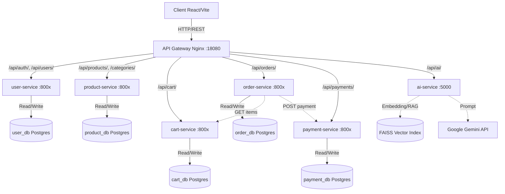
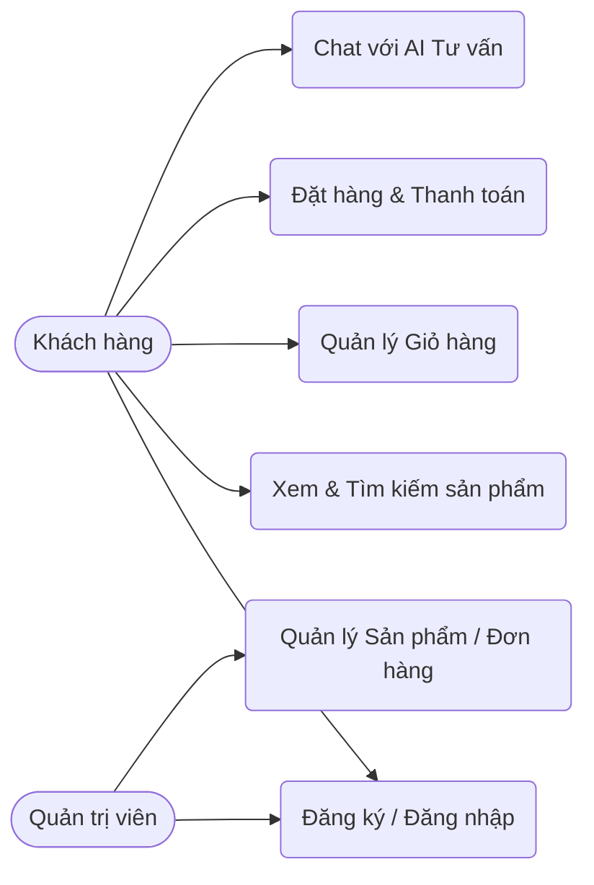
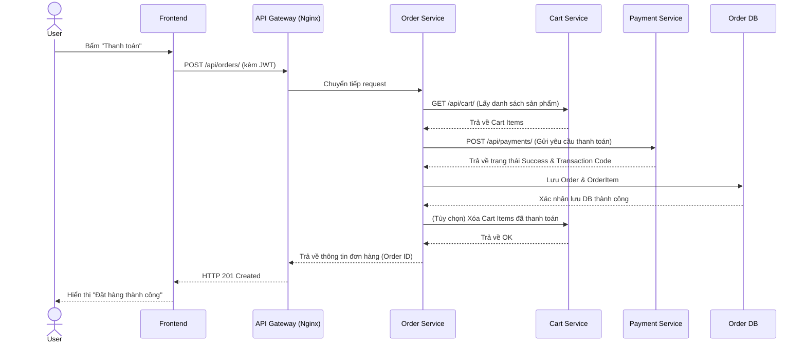
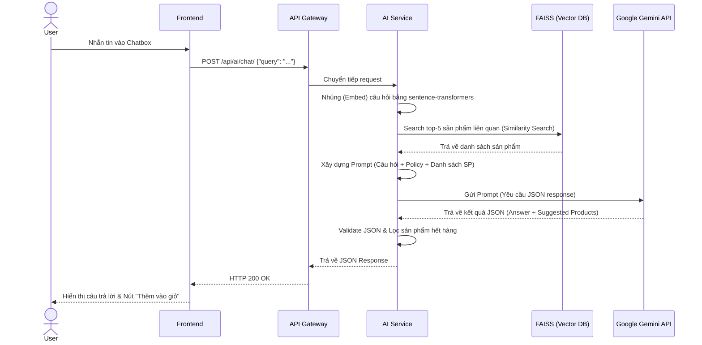

# Báo Cáo Hệ Thống E-Commerce TechStore (Microservices Architecture)

## 1. Tổng Quan Hệ Thống (System Overview)
TechStore là hệ thống thương mại điện tử dựa trên kiến trúc **Microservices**.
- **Mục đích:** Cung cấp trải nghiệm mua sắm hoàn chỉnh (Đăng ký/đăng nhập, duyệt sản phẩm, giỏ hàng, đặt hàng, thanh toán) tích hợp AI Chatbot và Recommendation.
- **Kiến trúc:** 6 Microservices độc lập, giao tiếp thông qua REST API (đồng bộ).
- **API Gateway:** Sử dụng Nginx làm entrypoint (cổng 18080).
- **Xác thực:** JWT (JSON Web Token) chia sẻ chung secret key giữa các service.
- **Database:** Pattern Database-per-Service sử dụng PostgreSQL cho 5 dịch vụ ứng dụng.

## 2. Sơ Đồ Kiến Trúc (Architecture Diagram)

## 3. Sơ Đồ Use Case & Sơ Đồ Tuần Tự (UML Diagrams)

### 3.1. Sơ Đồ Use Case (Use Case Diagram)
Mô tả các chức năng chính mà người dùng (Customer) và Quản trị viên (Admin) có thể thực hiện trên hệ thống.

### 3.2. Sơ Đồ Tuần Tự: Luồng Thanh Toán (Checkout Sequence Diagram)
Mô tả quá trình giao tiếp liên dịch vụ (sync) khi người dùng thực hiện thanh toán đơn hàng.

### 3.3. Sơ Đồ Tuần Tự: Luồng AI Chatbot (RAG Sequence Diagram)
Mô tả luồng người dùng chat với AI lấy dữ liệu thực tế từ hệ thống (Retrieval-Augmented Generation).

## 4. Danh Sách Microservices

| Service | Framework | Database | Chức Năng Chính |
|---------|-----------|----------|-----------------|
| **user-service** | Django + DRF | `user_db` | Quản lý người dùng, JWT Auth, Phân quyền, Profile. |
| **product-service** | Django + DRF | `product_db` | Quản lý Catalog sản phẩm, Categories, Brands. Có sẵn script sinh data. |
| **cart-service** | Django + DRF | `cart_db` | Quản lý giỏ hàng (thêm/xóa/sửa item), mỗi user gắn với 1 cart. |
| **order-service** | Django + DRF | `order_db` | Tạo và quản lý đơn hàng. Tích hợp thanh toán chéo service. |
| **payment-service** | Django + DRF | `payment_db` | Dịch vụ mock thanh toán (luôn trả về trạng thái success). |
| **ai-service** | FastAPI | (Không) | Hybrid Recommendation, RAG Chatbot sử dụng LLM Gemini & FAISS. |

*(Chú thích: Mỗi service chạy trên container Docker độc lập. Các database không sử dụng Foreign Key liên kết với nhau để đảm bảo tính lỏng lẻo - loose coupling).*

## 5. Các File Code Trọng Yếu

Hệ thống yêu cầu các thành phần file sau để triển khai chính xác theo cấu trúc mô tả trong báo cáo:
- `docker-compose.yml`: Khai báo và quản lý 6 services, 5 DBs, Gateway, và Frontend.
- `gateway/nginx.conf`: File cấu hình routing proxy_pass từ API Gateway tới các backend microservices.
- `user-service/users/models.py`, `product-service/products/models.py`: Định nghĩa DB models đại diện cho các entity chính.
- `order-service/orders/views.py`: Nơi xử lý logic kết nối liên dịch vụ (gọi HTTP synchronous sang `cart-service` để chốt đơn, gọi sang `payment-service` để trả tiền).
- `ai-service/app/main.py`: FastAPI endpoint nhận request chat và recommend.
- `ai-service/app/gemini_client.py`: Logic tương tác với Google Gemini API.
- `ai-service/app/rag_engine.py`: Logic nhúng (embedding) mô tả sản phẩm và sử dụng vector database FAISS để retrieve dữ liệu.
- `frontend/src/...`: Các component React, cấu hình Axios interceptor truyền JWT Token, quản lý global state qua Zustand.

## 6. Phân Tích Sự Bất Đồng (Discrepancies) Giữa Code & Báo Cáo

Dựa trên code thực tế và Báo cáo lý thuyết bạn cung cấp, phát hiện một vài điểm chưa khớp cần điều chỉnh:

1. **Phiên bản Gemini API Model:**
   - *Trong Báo cáo:* Ghi rõ sử dụng mô hình `gemini-1.5-flash`.
   - *Trong Code:* Tại `ai-service/app/gemini_client.py` dòng 18, code đang hardcode sử dụng `gemini-1.0-pro`.
2. **Port Khởi Chạy Frontend:**
   - *Trong Báo cáo:* Frontend map port host ra `13000:3000`.
   - *Trong Code:* Tại `docker-compose.yml`, frontend đang cấu hình map port host là `5173:80` (sử dụng base image Nginx chạy file build của Vite).
3. **Cổng Internal (Container Port) của Django Services:**
   - *Trong Báo cáo:* Các service (user, product, cart, order, payment) lắng nghe ở cổng `8000`.
   - *Trong Code:* Mỗi service được expose và bind ở một cổng riêng biệt (`8001` đến `8005`) trong Dockerfile cũng như proxy của Nginx. Đây là practice tốt để tránh lỗi khi dev trên host, nhưng khác với text trong tài liệu.

## 7. Checklist Kiểm Tra Hệ Thống

| Hạng mục | Tài liệu mô tả | Code hiện hành | Trạng thái | Đề xuất |
|---|---|---|---|---|
| **Kiến trúc** | Microservices, Docker | Đã chia tách thành các module | ✅ Đồng bộ | Không có |
| **API Gateway** | Nginx port 18080 | Nginx map 18080:80 | ✅ Đồng bộ | Không có |
| **Cơ sở dữ liệu** | Database-per-service | 5 containers PostgreSQL | ✅ Đồng bộ | Không có |
| **Xác thực API** | Share JWT Secret Key | Dùng `drf-simplejwt` chung key | ✅ Đồng bộ | Không có |
| **Frontend Mapping** | `13000:3000` | `5173:80` | ⚠️ Lệch | Nên sửa text báo cáo hoặc cập nhật docker-compose |
| **Django Internal Port**| `8000` | `8001`, `8002`, `8003`, v.v. | ⚠️ Lệch | Bổ sung lý do sử dụng port khác nhau vào báo cáo |
| **Mô hình AI RAG** | `gemini-1.5-flash` | `gemini-1.0-pro` | ⚠️ Lệch | Đổi code trong `gemini_client.py` thành 1.5-flash |

## 8. Prompt Khuyến Nghị Dành Cho Lượt Dev Tiếp Theo

Để tôi (Agent) có thể tự động sửa lại code cho khớp 100% với báo cáo, bạn chỉ cần copy và paste câu Prompt sau đây vào chatbox:

> *"Hãy giúp tôi fix những điểm bất đồng giữa báo cáo và code: 1) Cập nhật model thành `gemini-1.5-flash` trong `ai-service`. 2) Đổi port frontend trong `docker-compose.yml` thành `13000:3000` (nếu cần đổi config nginx của frontend thì hãy xử lý luôn). 3) Cập nhật lại Gateway `nginx.conf` và các Dockerfile nếu bạn thấy cần đưa tất cả internal ports về `8000` như báo cáo mô tả, hoặc giải thích cho tôi để tôi tự sửa trong file word."*
