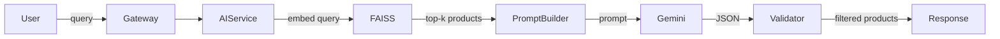
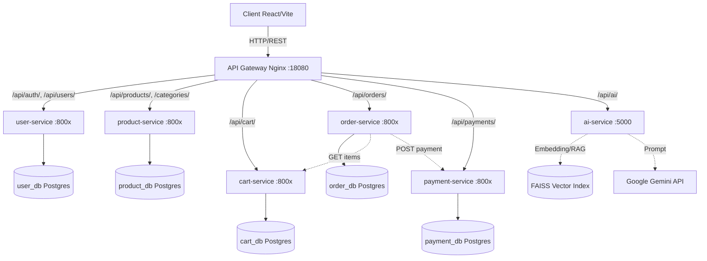
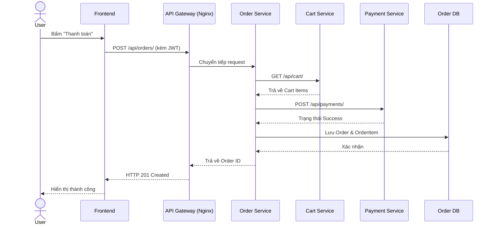

## MỤC LỤC

- **Lời mở đầu**
- **Chương 1: Từ Monolithic đến Microservices và DDD**
  - 1.1. Giới thiệu Monolithic Architecture
  - 1.2. Microservices Architecture
  - 1.3. Domain Driven Design (DDD)
  - 1.4. Case Study: Phân rã hệ thống E‑Commerce TechStore
- **Chương 2: Phát triển Hệ thống E‑Commerce Microservices**
  - 2.1. Xác định yêu cầu
  - 2.2. Phân rã hệ thống theo DDD (6 Bounded Contexts)
  - 2.3. Thiết kế chi tiết từng service (kèm code model)
  - 2.4. Thiết kế Database – Database‑per‑Service (PostgreSQL)
  - 2.5. So sánh MySQL vs PostgreSQL & lý do chọn PostgreSQL
  - 2.6. Luồng hệ thống tổng thể (End‑to‑End)
  - 2.7. Hướng dẫn thực hành
- **Chương 3: AI Service cho tư vấn sản phẩm (Gemini + RAG + Hybrid)**
  - 3.1. Mục tiêu và kiến trúc tổng thể
  - 3.2. Thu thập và sinh dữ liệu
  - 3.3. RAG – FAISS + Sentence‑Transformer
  - 3.4. Gemini API – Cấu hình, prompt, validation
  - 3.5. Hybrid Scoring & Recommendation API
  - 3.6. Chatbot API chi tiết
  - 3.7. Triển khai AI Service (FastAPI + Docker)
  - 3.8. Bài tập + Checklist
- **Chương 4: Xây dựng hệ thống hoàn chỉnh (Docker + Nginx + React)**
  - 4.1. Kiến trúc tổng thể và nguyên tắc
  - 4.2. API Gateway (Nginx) – cấu hình routing
  - 4.3. Xác thực JWT – luồng hoạt động
  - 4.4. Giao tiếp giữa các service (REST, timeout, retry)
  - 4.5. Docker hóa từng service & docker‑compose.yml
  - 4.6. Luồng End‑to‑End: Mua hàng (sequence logic)
  - 4.7. Đánh giá hệ thống
  - 4.8. Bài tập thực hành + Checklist
- **Kết luận**
- **Tài liệu tham khảo**

---

## LỜI MỞ ĐẦU

Ngày nay, các hệ thống thương mại điện tử (E‑Commerce) không chỉ đơn thuần là nơi trưng bày sản phẩm mà còn phải đáp ứng trải nghiệm người dùng được cá nhân hóa, khả năng chịu tải cao vào các dịp khuyến mãi, và tích hợp trí tuệ nhân tạo (AI) để tư vấn bán hàng. Kiến trúc Monolithic truyền thống nhanh chóng bộc lộ hạn chế về khả năng mở rộng, bảo trì và độ tin cậy khi hệ thống phát triển lớn.

Bài tiểu luận này trình bày việc thiết kế và xây dựng hệ thống **TechStore** – một nền tảng E‑Commerce hiện đại dựa trên kiến trúc **Microservices**, sử dụng **Django REST Framework** cho các service nghiệp vụ, **PostgreSQL** làm database, **API Gateway Nginx**, xác thực bằng **JWT**, và đặc biệt là **AI Service** độc lập được xây dựng bằng **FastAPI + Gemini API + FAISS + RAG** để cung cấp gợi ý sản phẩm thông minh và chatbot tư vấn. Toàn bộ hệ thống được đóng gói bằng **Docker**, đảm bảo tính nhất quán giữa môi trường phát triển và triển khai.

Mục tiêu của tiểu luận là thể hiện một quy trình thiết kế có hệ thống từ phân rã nghiệp vụ (DDD), lựa chọn công nghệ, xây dựng database‑per‑service, tích hợp AI, đến triển khai container hoá. Qua đó, làm rõ các lợi ích cũng như thách thức khi áp dụng Microservices trong bài toán E‑Commerce thực tế.

---

# CHƯƠNG 1: TỪ MONOLITHIC ĐẾN MICROSERVICES VÀ DDD

## 1.1 Giới thiệu Monolithic Architecture

### 1.1.1 Khái niệm
Monolithic Architecture là mô hình trong đó toàn bộ ứng dụng (giao diện người dùng, logic nghiệp vụ, truy cập dữ liệu) được xây dựng và triển khai như một khối duy nhất.

### 1.1.2 Cấu trúc điển hình
- **Presentation Layer (UI):** Giao diện người dùng.
- **Business Logic Layer:** Xử lý nghiệp vụ (tính giá, kiểm tra tồn kho, tạo order).
- **Data Access Layer:** Kết nối database, truy vấn SQL/ORM.

### 1.1.3 Ví dụ thực tế
Một hệ thống E‑Commerce monolithic ban đầu gồm các module: Quản lý sản phẩm, Giỏ hàng, Thanh toán, Người dùng – tất cả nằm chung một codebase Django và một database.

### 1.1.4 Nhược điểm chi tiết
- **Khó mở rộng (Scalability):** Phải scale toàn bộ hệ thống, không thể scale riêng module nào.
- **Coupling cao:** Một thay đổi nhỏ trong model `Product` có thể ảnh hưởng dây chuyền đến `Cart`, `Order`, `Payment`.
- **Deploy rủi ro cao:** Lỗi ở một module (vd: thanh toán) có thể làm sập toàn bộ ứng dụng.
- **Khó phát triển nhóm:** Nhiều team cùng làm việc trên một codebase dễ xảy ra xung đột và khó áp dụng công nghệ mới.

### 1.1.5 Khi nào nên dùng Monolithic
- Hệ thống nhỏ, số lượng tính năng ít, team ít người (< 5 dev).
- Giai đoạn MVP (Minimum Viable Product) cần ra sản phẩm nhanh.
- Chưa xác định rõ domain boundary.

## 1.2 Microservices Architecture

### 1.2.1 Khái niệm
Microservices là kiến trúc chia hệ thống thành các dịch vụ nhỏ, độc lập, mỗi service thực hiện một chức năng nghiệp vụ riêng biệt, có database riêng, giao tiếp qua API và có thể deploy độc lập.

### 1.2.2 Đặc điểm
- **Database‑per‑Service:** Mỗi service sở hữu database riêng.
- **Giao tiếp qua REST API** (hoặc gRPC).
- **Deploy độc lập:** Một service thay đổi không ảnh hưởng service khác.
- **Polyglot:** Có thể dùng ngôn ngữ/framework khác nhau cho từng service.

### 1.2.3 So sánh Monolithic vs Microservices

| Tiêu chí | Monolithic | Microservices |
|:---|:---|:---|
| Deploy | Một lần, toàn bộ hệ thống | Nhiều lần, từng service độc lập |
| Scale | Toàn hệ | Từng service riêng lẻ |
| Coupling | Cao (phụ thuộc chặt) | Thấp (giao tiếp qua API) |
| Database | Một database tập trung | Mỗi service một database |
| Công nghệ | Bị lock‑in | Tự do lựa chọn |
| Fault Isolation | Kém – lỗi một module sập cả hệ | Tốt – lỗi được cô lập |

### 1.2.4 Ưu điểm
- Scale độc lập, tiết kiệm tài nguyên.
- Tăng tốc phát triển (nhiều team làm song song).
- Dễ dàng thay thế / nâng cấp từng service.
- Fault Isolation – hệ thống vẫn hoạt động ngay cả khi một service gặp sự cố.

### 1.2.5 Nhược điểm
- Phức tạp hệ thống: cần quản lý nhiều service, nhiều database.
- Vấn đề distributed system: network latency, partial failure, eventual consistency.
- Debug khó hơn: cần distributed tracing (Jaeger), logging tập trung (ELK).
- Chi phí hạ tầng cao hơn (Docker, orchestration).

### 1.2.6 Nguyên tắc thiết kế
- **Single Responsibility:** mỗi service chỉ làm một việc (bounded context).
- **Loose Coupling:** service không phụ thuộc trực tiếp vào internal của service khác.
- **High Cohesion:** code trong một service gắn kết chặt chẽ với nghiệp vụ.
- **API First:** thiết kế contract API trước khi code.
- **Failure Tolerance:** luôn handle lỗi khi gọi service khác (timeout, retry, fallback).

## 1.3 Domain Driven Design (DDD)

### 1.3.1 Mục tiêu
DDD tập trung vào mô hình hóa hệ thống dựa trên nghiệp vụ (business domain), tạo ra ngôn ngữ chung giữa chuyên gia nghiệp vụ và đội ngũ phát triển, từ đó tách biệt logic phức tạp khỏi công nghệ hạ tầng.

### 1.3.2 Các khái niệm cốt lõi
- **Entity:** có định danh riêng (ID). Ví dụ: `User`, `Product`, `Order`.
- **Value Object:** không có ID, so sánh bằng giá trị. Ví dụ: `Address`, `Money`.
- **Aggregate:** nhóm các Entity liên quan, có Aggregate Root quản lý. Ví dụ: `Order` (root) chứa `OrderItem`.
- **Bounded Context:** ranh giới logic của một domain, nơi các khái niệm có nghĩa cụ thể.
- **Repository:** trừu tượng hoá việc truy xuất Aggregate.
- **Domain Service:** logic nghiệp vụ không thuộc về một Entity cụ thể.

### 1.3.3 Context Map
Context Map là sơ đồ thể hiện mối quan hệ giữa các Bounded Contexts. Các quan hệ phổ biến: **Shared Kernel** (dùng chung model), **Customer‑Supplier** (phụ thuộc có thứ tự), **Anti‑Corruption Layer** (ngăn xâm nhập khái niệm lạ).

### 1.3.4 DDD trong Microservices
- **Mỗi Bounded Context ánh xạ 1‑1 với một Microservice.**
- **Tránh chia service theo technical layer** (controller / service / repository).
- **Ubiquitous Language** phải được dùng thống nhất trong code, API, và database schema.

## 1.4 Case Study: Phân rã hệ thống E‑Commerce TechStore

**Bước 1 – Xác định Domain**
- Core Domain: User, Product, Cart, Order, Payment, Shipping.
- Supporting Domain: Review, Search, Notification.
- Generic Subdomain: Authentication (JWT), AI Recommendation.

**Bước 2 – Xác định Bounded Context (6 BCs)**
- **User Context** → `user-service`
- **Product Context** → `product-service` (quản lý Book, Electronics, Fashion)
- **Cart Context** → `cart-service`
- **Order Context** → `order-service`
- **Payment Context** → `payment-service`
- **AI Context** → `ai-service` (RAG + Gemini)

**Bước 3 – Phân rã thành Microservices**
Mỗi BC tương ứng một service, có database PostgreSQL riêng, giao tiếp qua REST API, xác thực bằng JWT.

**Bước 4 – Xác định quan hệ & luồng giao tiếp**
- `order-service` gọi `cart-service` → lấy cart items.
- `order-service` gọi `payment-service` → tạo payment (mock).
- `order-service` gọi `shipping-service` (mock) → tạo shipment.
- `ai-service` gọi `product-service` → lấy dữ liệu sản phẩm để build FAISS index.

**Ví dụ API**
- `GET /api/products/` – product-service
- `POST /api/cart/items/` – cart-service
- `POST /api/orders/` – order-service
- `POST /api/ai/chat/` – ai-service (Gemini + RAG)

---

# CHƯƠNG 2: PHÁT TRIỂN HỆ THỐNG E‑COMMERCE MICROSERVICES

## 2.1 Xác định yêu cầu

### 2.1.1 Yêu cầu chức năng
- Quản lý sản phẩm đa domain (Book, Electronics, Fashion).
- Quản lý người dùng với vai trò (admin, staff, customer).
- Giỏ hàng (thêm/sửa/xóa sản phẩm).
- Đặt hàng, lịch sử đơn hàng.
- Thanh toán (mock).
- Giao hàng (mock).
- Gợi ý sản phẩm bằng AI + Chatbot tư vấn.

### 2.1.2 Yêu cầu phi chức năng
- **Scalability:** Mỗi service có thể scale độc lập (dùng replicas).
- **High Availability:** API Gateway + retry logic.
- **Security:** JWT authentication, RBAC, HTTPS.
- **Maintainability:** Code rõ ràng, mỗi service một project riêng.
- **Portability:** Chạy được với `docker compose up`.

## 2.2 Phân rã hệ thống theo DDD (6 Bounded Contexts)

| Bounded Context | Microservice | Database | Chức năng chính |
|:---|:---|:---|:---|
| User | `user-service` | user_db | Đăng ký, đăng nhập, JWT, phân quyền |
| Product | `product-service` | product_db | CRUD sản phẩm đa domain, category, brand |
| Cart | `cart-service` | cart_db | Giỏ hàng (thêm/sửa/xóa) |
| Order | `order-service` | order_db | Đặt hàng, gọi payment + shipping |
| Payment | `payment-service` | payment_db | Thanh toán mock (luôn success) |
| AI | `ai-service` | (không DB riêng) | Gợi ý sản phẩm, chatbot Gemini |

**Nguyên tắc:** Mỗi service có database riêng, không share database. Giao tiếp qua REST API (synchronous). Không service nào truy cập trực tiếp database của service khác.

## 2.3 Thiết kế chi tiết từng service (kèm code model Django)

### 2.3.1 Product Service
Hỗ trợ 3 domain sản phẩm (Book, Electronics, Fashion) dùng kỹ thuật **Table Inheritance** (OneToOneField).

```python
# product-service/products/models.py
from django.db import models

class Category(models.Model):
    name = models.CharField(max_length=100, unique=True)
    slug = models.SlugField(unique=True)
    parent = models.ForeignKey('self', null=True, blank=True, on_delete=models.CASCADE)
    is_active = models.BooleanField(default=True)

class Product(models.Model):
    name = models.CharField(max_length=255)
    slug = models.SlugField(unique=True)
    sku = models.CharField(max_length=100, unique=True)
    description = models.TextField(blank=True)
    price = models.DecimalField(max_digits=12, decimal_places=2)
    stock = models.IntegerField(default=0)
    category = models.ForeignKey(Category, on_delete=models.PROTECT)
    is_active = models.BooleanField(default=True)

class Book(models.Model):
    product = models.OneToOneField(Product, on_delete=models.CASCADE, primary_key=True)
    author = models.CharField(max_length=255)
    isbn = models.CharField(max_length=20)

class Electronics(models.Model):
    product = models.OneToOneField(Product, on_delete=models.CASCADE, primary_key=True)
    brand = models.CharField(max_length=100)
    warranty_months = models.IntegerField()

class Fashion(models.Model):
    product = models.OneToOneField(Product, on_delete=models.CASCADE, primary_key=True)
    size = models.CharField(max_length=10)
    color = models.CharField(max_length=50)
```

### 2.3.2 User Service
Kế thừa AbstractUser, thêm trường role.

```python
# user-service/users/models.py
from django.contrib.auth.models import AbstractUser
from django.db import models

class User(AbstractUser):
    ROLE_CHOICES = (
        ('admin', 'Admin'),
        ('staff', 'Staff'),
        ('customer', 'Customer'),
    )
    role = models.CharField(max_length=20, choices=ROLE_CHOICES, default='customer')
    phone = models.CharField(max_length=20, blank=True)
    address = models.TextField(blank=True)
```

### 2.3.3 Cart Service

```python
# cart-service/cart/models.py
from django.db import models

class Cart(models.Model):
    user_id = models.IntegerField(unique=True)
    created_at = models.DateTimeField(auto_now_add=True)

class CartItem(models.Model):
    cart = models.ForeignKey(Cart, on_delete=models.CASCADE, related_name='items')
    product_id = models.IntegerField()
    quantity = models.PositiveIntegerField(default=1)
    added_at = models.DateTimeField(auto_now_add=True)
```

### 2.3.4 Order Service

```python
# order-service/orders/models.py
from django.db import models

class Order(models.Model):
    STATUS_CHOICES = (
        ('pending', 'Pending'),
        ('paid', 'Paid'),
        ('shipping', 'Shipping'),
        ('delivered', 'Delivered'),
        ('cancelled', 'Cancelled'),
    )
    user_id = models.IntegerField()
    total_amount = models.DecimalField(max_digits=12, decimal_places=2)
    status = models.CharField(max_length=20, choices=STATUS_CHOICES, default='pending')
    created_at = models.DateTimeField(auto_now_add=True)

class OrderItem(models.Model):
    order = models.ForeignKey(Order, on_delete=models.CASCADE, related_name='items')
    product_id = models.IntegerField()
    product_name = models.CharField(max_length=255)
    unit_price = models.DecimalField(max_digits=12, decimal_places=2)
    quantity = models.PositiveIntegerField()
```

### 2.3.5 Payment Service (mock)

```python
# payment-service/payments/models.py
from django.db import models

class Payment(models.Model):
    order_id = models.IntegerField(unique=True)
    amount = models.DecimalField(max_digits=12, decimal_places=2)
    status = models.CharField(max_length=20, choices=[('pending','Pending'),('success','Success'),('failed','Failed')], default='pending')
    transaction_code = models.CharField(max_length=100, blank=True)
```

## 2.4 Thiết kế Database – Database‑per‑Service (PostgreSQL)
Lý do chọn PostgreSQL cho tất cả service:

Hỗ trợ JSONB (có thể dùng cho sản phẩm đa dạng).

Hiệu năng cao với các truy vấn phức tạp (JOIN nhiều bảng).

Tuân thủ ACID tốt, phù hợp với order, payment.

Cộng đồng mạnh, tài liệu phong phú.

Chi tiết database (PostgreSQL) cho từng service:

```sql
-- user_db
CREATE TABLE users_user (
    id SERIAL PRIMARY KEY,
    username VARCHAR(150) UNIQUE NOT NULL,
    password VARCHAR(128) NOT NULL,
    role VARCHAR(20) NOT NULL,
    email VARCHAR(254) UNIQUE NOT NULL,
    phone VARCHAR(20),
    address TEXT
);

-- product_db
CREATE TABLE products_category (
    id SERIAL PRIMARY KEY,
    name VARCHAR(100) UNIQUE NOT NULL,
    slug VARCHAR(120) UNIQUE NOT NULL,
    parent_id INTEGER REFERENCES products_category(id),
    is_active BOOLEAN DEFAULT TRUE
);

CREATE TABLE products_product (
    id SERIAL PRIMARY KEY,
    name VARCHAR(255) NOT NULL,
    slug VARCHAR(280) UNIQUE NOT NULL,
    sku VARCHAR(100) UNIQUE NOT NULL,
    description TEXT,
    price DECIMAL(12,2) NOT NULL,
    stock INTEGER NOT NULL DEFAULT 0,
    category_id INTEGER REFERENCES products_category(id),
    is_active BOOLEAN DEFAULT TRUE
);

CREATE TABLE products_book (
    product_id INTEGER PRIMARY KEY REFERENCES products_product(id) ON DELETE CASCADE,
    author VARCHAR(255) NOT NULL,
    isbn VARCHAR(20) NOT NULL
);
-- Tương tự cho electronics, fashion

-- cart_db
CREATE TABLE cart_cart (
    id SERIAL PRIMARY KEY,
    user_id INTEGER NOT NULL UNIQUE,
    created_at TIMESTAMP DEFAULT NOW()
);
CREATE TABLE cart_cartitem (
    id SERIAL PRIMARY KEY,
    cart_id INTEGER REFERENCES cart_cart(id) ON DELETE CASCADE,
    product_id INTEGER NOT NULL,
    quantity INTEGER NOT NULL DEFAULT 1
);

-- order_db
CREATE TABLE orders_order (
    id SERIAL PRIMARY KEY,
    user_id INTEGER NOT NULL,
    total_amount DECIMAL(12,2) NOT NULL,
    status VARCHAR(20) DEFAULT 'pending',
    created_at TIMESTAMP DEFAULT NOW()
);
CREATE TABLE orders_orderitem (
    id SERIAL PRIMARY KEY,
    order_id INTEGER REFERENCES orders_order(id) ON DELETE CASCADE,
    product_id INTEGER NOT NULL,
    product_name VARCHAR(255) NOT NULL,
    unit_price DECIMAL(12,2) NOT NULL,
    quantity INTEGER NOT NULL
);

-- payment_db
CREATE TABLE payments_payment (
    id SERIAL PRIMARY KEY,
    order_id INTEGER NOT NULL UNIQUE,
    amount DECIMAL(12,2) NOT NULL,
    status VARCHAR(20) DEFAULT 'pending',
    transaction_code VARCHAR(100)
);

Lưu ý quan trọng: Các trường user_id, product_id, order_id là reference ID không có ràng buộc khóa ngoại ở cấp database. Tính toàn vẹn được đảm bảo ở tầng ứng dụng – đảm bảo loose coupling.
```

## 2.5 So sánh MySQL vs PostgreSQL & lý do chọn PostgreSQL

| Tiêu chí | MySQL | PostgreSQL |
|:---|:---|:---|
| Hiệu năng truy vấn đơn giản | Rất tốt | Tốt |
| Hỗ trợ JSON | Cơ bản, hiệu năng trung bình | **Mạnh mẽ (JSONB, GIN index)** |
| Xử lý quan hệ phức tạp | Trung bình | **Rất tốt (nhiều kiểu JOIN)** |
| Tuân thủ ACID | Tốt (InnoDB) | **Rất tốt (SSI)** |
| Phù hợp với | User, Cart | **Product, Order, Payment, AI** |

**Kết luận:** Tất cả 6 service đều dùng PostgreSQL để đơn giản hóa migration, backup và vận hành.

## 2.6 Luồng hệ thống tổng thể (End‑to‑End)

**Use Case: Mua hàng (checkout)**

| Bước | Hành động | Service gọi | API |
|:---|:---|:---|:---|
| 1 | Đăng nhập | `user-service` | `POST /api/auth/login/` |
| 2 | Xem danh sách sản phẩm | `product-service` | `GET /api/products/` |
| 3 | Xem chi tiết sản phẩm | `product-service` | `GET /api/products/{id}` |
| 4 | Thêm vào giỏ hàng | `cart-service` | `POST /api/cart/items/` |
| 5 | Tiến hành thanh toán (checkout) | `order-service` | `POST /api/orders/` |
| 5a | Lấy cart items | `order-service` → `cart-service` | `GET /api/cart/` |
| 5b | Reserve tồn kho (mock) | `order-service` → `product-service` | (có thể gọi để kiểm tra stock) |
| 5c | Tạo payment | `order-service` → `payment-service` | `POST /api/payments/` |
| 5d | Tạo shipment (mock) | `order-service` → (giả lập) | – |
| 6 | Trả về `order_id` + `tracking_code` | `order-service` | `HTTP 201` |

**Sequence logic (synchronous REST calls):**
- `order-service` gọi `cart-service` để lấy items.
- `order-service` gọi `payment-service` (mock: luôn success).
- Sau khi payment thành công, `order-service` cập nhật status.
- Giao tiếp có timeout 5 giây, retry 1 lần, fallback nếu lỗi.

## 2.7 Hướng dẫn thực hành

**Sinh viên cần thực hiện:**

1. Vẽ **Class Diagram** cho từng service (đúng UML, quan hệ Association / Inheritance / Composition).
2. **Mapping Class Diagram sang Database** (đã có ví dụ ở mục 2.4).
3. **Viết script khởi tạo database** (dùng migration Django hoặc file `.sql`).

**Kiểm tra checklist:**

- [ ] Có class diagram đúng UML
- [ ] Có mapping rõ ràng
- [ ] Database tách riêng từng service
- [ ] Sử dụng PostgreSQL cho tất cả service

# CHƯƠNG 3: AI SERVICE CHO TƯ VẤN SẢN PHẨM (GEMINI + RAG + HYBRID)

## 3.1 Mục tiêu và kiến trúc tổng thể

**Mục tiêu:**
- Cung cấp **Recommendation API** gợi ý sản phẩm dựa trên popularity + co‑occurrence.
- Cung cấp **Chatbot API** sử dụng RAG (retrieve từ FAISS) + Gemini API để sinh câu trả lời tự nhiên, bám sát dữ liệu shop.

**Kiến trúc AI Service:**



## 3.2 Thu thập và sinh dữ liệu

AI Service tự sinh synthetic data khi khởi động lần đầu:

- `data/products.json`: 50 sản phẩm (id, name, description, price, stock, category).
- `data/user_behavior.csv`: 5000+ dòng (user_id, product_id, action, timestamp) với 100 user.
- `data/policy.txt`: chính sách shop (đổi trả, vận chuyển, bảo hành).

## 3.3 RAG (Retrieval-Augmented Generation) – FAISS + Sentence‑Transformer

- **Embedding:** Dùng `all-MiniLM-L6-v2` (sentence‑transformers) → vector 384 chiều.
- **Vector database:** FAISS (IndexFlatIP).
- **Retrieve:** embedding câu hỏi → tìm top‑5 sản phẩm gần nhất (cosine similarity).

## 3.4 Gemini API – Cấu hình, prompt engineering, JSON validation

- **Model:** `gemini-1.5-flash` (khuyến nghị) hoặc `gemini-1.0-pro`.
- **Prompt yêu cầu trả về JSON** với các trường `answer`, `suggested_products` (gồm id, name, price).
- **Validation:** kiểm tra product id có tồn tại không, price có khớp với database không, stock > 0.
- **Fallback:** nếu Gemini lỗi hoặc JSON sai → trả câu trả lời template + sản phẩm phổ biến.

## 3.5 Hybrid Scoring & Recommendation API

`GET /api/ai/recommend?user_id=1&product_id=2&limit=5`

- Nếu có `product_id`: gợi ý sản phẩm cùng category (content‑based).
- Nếu không: gợi ý sản phẩm phổ biến (dựa trên action purchase) + co‑occurrence.
- Công thức: `score = 0.6*popularity + 0.4*co_occurrence`.

## 3.6 Chatbot API chi tiết

**Endpoint:** `POST /api/ai/chat`
Payload: `{"user_id": 1, "query": "tôi cần laptop gaming dưới 15 triệu"}`

**Luồng xử lý:**
1. Retrieve top‑5 sản phẩm từ FAISS.
2. Build prompt (context + policy + yêu cầu JSON).
3. Gửi đến Gemini API (timeout 10s, retry 2).
4. Validate JSON, lọc sản phẩm hết hàng.
5. Fallback nếu lỗi.

**Prompt mẫu:**  
Bạn là trợ lý bán hàng của TechStore. Hãy trả lời bằng JSON.
Dữ liệu shop: {top_products} {policy}
Câu hỏi: {query}
Trả về JSON: {"answer": "...", "suggested_products": [{"id":..., "name":..., "price":...}]}
Chỉ gợi ý sản phẩm có stock > 0. Không bịa giá.

## 3.7 Triển khai AI Service (FastAPI + Docker)

**Tech stack:** FastAPI, sentence‑transformers, faiss-cpu, google-generativeai, pandas, numpy.

**Các file chính:**

- `app/main.py`: FastAPI endpoints.
- `app/rag_engine.py`: FAISS index, retrieve.
- `app/gemini_client.py`: gọi Gemini, parse JSON.
- `app/seed_data.py`: sinh dữ liệu mẫu.
- `Dockerfile`, `requirements.txt`.

## 3.8 Bài tập + Checklist đánh giá

**Bài tập:**

1. Chạy AI Service local, test `/recommend`.
2. Gửi câu hỏi đến `/chat`, quan sát câu trả lời.
3. Test fallback (sai API key).

**Checklist:**

- [ ] Pipeline RAG rõ ràng
- [ ] Có FAISS index và embedding
- [ ] Gọi được Gemini API, xử lý JSON
- [ ] Có fallback khi Gemini lỗi
- [ ] AI Service chạy độc lập với Docker

# CHƯƠNG 4: XÂY DỰNG HỆ THỐNG HOÀN CHỈNH (DOCKER + NGINX + REACT)

## 4.1 Kiến trúc tổng thể và nguyên tắc

**Sơ đồ kiến trúc tổng thể (lặp lại để liền mạch):**



## 4.2 API Gateway (Nginx) – cấu hình routing

**`gateway/nginx.conf`:**
```nginx
events { worker_connections 1024; }
http {
    upstream user_service { server user-service:8000; }
    upstream product_service { server product-service:8000; }
    upstream cart_service { server cart-service:8000; }
    upstream order_service { server order-service:8000; }
    upstream payment_service { server payment-service:8000; }
    upstream ai_service { server ai-service:5000; }

    server {
        listen 80;
        resolver 127.0.0.11 valid=10s ipv6=off;

        location /api/auth/ { proxy_pass http://user_service; }
        location /api/users/ { proxy_pass http://user_service; }
        location /api/products/ { proxy_pass http://product_service; }
        location /api/cart/ { proxy_pass http://cart_service; }
        location /api/orders/ { proxy_pass http://order_service; }
        location /api/payments/ { proxy_pass http://payment_service; }
        location /api/ai/ { proxy_pass http://ai_service; }
        location /health/ { return 200 '{"status":"ok"}'; }
    }
}
```

## 4.3 Xác thực JWT – luồng hoạt động

- **Login:** `POST /api/auth/login/` → `user-service` → trả `access_token` (thời hạn 2 giờ) + `refresh_token` (thời hạn 7 ngày).
- **Lưu token:** Frontend lưu vào localStorage.
- **Gửi token:** Header `Authorization: Bearer <access_token>`.
- **Verify:** Các service dùng chung `JWT_SECRET_KEY` (biến môi trường) để xác thực token mà không cần gọi lại `user-service`.
- **Refresh:** Khi nhận mã lỗi 401, frontend gọi `POST /api/auth/refresh/` để lấy `access_token` mới và tự động retry request cũ.

## 4.4 Giao tiếp giữa các service (REST, timeout, retry)

Ví dụ `order-service` gọi `payment-service`:

```python
import requests, os
PAYMENT_URL = os.getenv("PAYMENT_SERVICE_URL", "http://payment-service:8000")

def create_order(request):
    # ... tạo order object
    try:
        resp = requests.post(
            f"{PAYMENT_URL}/api/payments/",
            json={"order_id": order.id, "amount": order.total_amount},
            timeout=5
        )
        if resp.status_code != 200:
            raise Exception("Payment failed")
    except requests.exceptions.Timeout:
        order.status = 'pending_payment'
        order.save()
```

## 4.5 Docker hóa từng service (Dockerfile) & docker-compose.yml

**Dockerfile mẫu cho Django service (user-service):**

FROM python:3.11-slim
WORKDIR /app
COPY requirements.txt .
RUN pip install --no-cache-dir -r requirements.txt
COPY . .
CMD ["sh", "-c", "python manage.py migrate && guincorn config.wsgi:application --bind 0.0.0.0:8000 --workers 2"]

---

### Dockerfile cho AI Service (FastAPI):

```dockerfile
FROM python:3.11-slim
WORKDIR /app
COPY requirements.txt .
RUN pip install --no-cache-dir -r requirements.txt
COPY . .
CMD ["uvicorn", "app:app", "--host", "0.0.0.0", "--port", "5000"]
```

## 4.6 Luồng End‑to‑End: Mua hàng (sequence logic)



## 4.7 Đánh giá hệ thống
Ưu điểm:

Loose coupling tương đối tốt, mỗi service nghiệp vụ có database PostgreSQL riêng.

AI Service tận dụng Gemini API + RAG để tư vấn và gợi ý sản phẩm theo ngữ cảnh.

Docker hóa đầy đủ, dễ triển khai bằng `docker compose up --build`.

JWT shared secret, stateless authentication giữa các service.

Có API Gateway Nginx làm entrypoint thống nhất cho toàn hệ thống.

Nhược điểm:

Giao tiếp đồng bộ (REST), có thể gây blocking khi service phụ thuộc bị chậm.

Chưa có message queue cho tác vụ bất đồng bộ.

Chưa có distributed tracing (Jaeger), khó debug xuyên service.

AI Service phụ thuộc Gemini API (chi phí, độ trễ, phụ thuộc mạng ngoài).

Redis chưa được cấu hình trong `docker-compose.yml` hiện tại.

Khả năng mở rộng:

Dễ scale ngang từng service (replicas/Kubernetes).

Có thể thay đổi database từng service mà không ảnh hưởng lớn tới service khác nếu giữ nguyên API contract.

Có thể thay Gemini bằng LLM local (vLLM/Ollama) trong `ai-service` mà không cần đổi frontend nếu giữ nguyên response contract.

Có thể bổ sung Redis để cache/queue/rate-limit mà không phá vỡ kiến trúc hiện tại.

## 4.8 Bài tập thực hành + Checklist
Bài tập thực hành:

Chạy `docker compose up --build`, kiểm tra gateway tại `http://localhost:18080/` và health endpoint `http://localhost:18080/api/health/`.

Đăng ký user qua `POST /api/auth/register/`, đăng nhập qua `POST /api/auth/login/`, lấy access token.

Gọi `POST /api/ai/chat` với câu hỏi: “tôi cần laptop gaming dưới 15 triệu” qua gateway `http://localhost:18080`.

Thực hiện luồng mua hàng: xem sản phẩm (`GET /api/products/`) -> thêm giỏ (`POST /api/cart/items/`) -> tạo đơn (`POST /api/orders/`) -> kiểm tra thanh toán (`GET /api/payments/by-order/{order_id}/` hoặc endpoint payment tương ứng).

Kiểm tra frontend tại `http://localhost:5173` và xác nhận frontend gọi API qua gateway.

Checklist đánh giá hệ thống:

Toàn bộ service chạy được bằng docker compose (5 DB PostgreSQL + user/product/cart/order/payment/ai + gateway + frontend).

Có API Gateway (Nginx) routing đúng cho `/api/auth`, `/api/users`, `/api/products`, `/api/categories`, `/api/brands`, `/api/cart`, `/api/orders`, `/api/payments`, `/api/ai`.

JWT auth hoạt động (login -> token -> gọi API bảo vệ thành công).

Flow mua hàng chạy end-to-end (products -> cart -> order -> payment mock).

AI Service trả về chat/recommendation hợp lý, có fallback khi cần.

Frontend gọi được API qua gateway và hiển thị dữ liệu.

Redis chưa được triển khai trong cấu hình hiện tại (chưa có Redis service trong `docker-compose.yml`).
